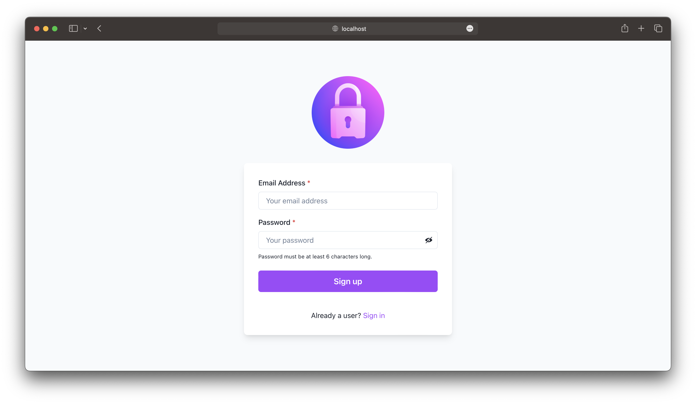

<div align="center">
   <a href="https://github.com/santiagomorelle/auth-project/tree/dev">
   
   </a>
   <h3 align="center">Authorization Project</h3>
   <p align="center">
      An awesome Firebase Authorization project built with React and Chakra UI using the ViteJS build tool!
      <br />
      <br />
      
      
       
      
      <br />
      <br />
      <a href="https://authorization-demo.netlify.app/">View Demo</a>
      ·
      <a href="mailto: santimorelle23@gmail.com">Report Bug</a>
   </p>
</div>

##



## Getting Started

To get a local copy up and running follow these simple steps:

### Prerequisites

1 - Firebase project

  https://console.firebase.google.com/

2 - NPM

  ```sh
  npm install npm@latest -g
  ```

### Installation

1 - Clone the repository.

   ```sh
   git clone https://github.com/santiagomorelle/authorization-project.git
   ```
   
2 - Install NPM packages.

   ```sh
   npm install
   ```
   
3 - Create an `.env` file to store environment variables. 

After creating your Firebase project:

  - Enable the _Email/Password_ sign-in provider in the Authentication page.

  - Go to Project Settings > General > SDK Setup and Configuration.
  
  - Copy the values from the `firebaseConfig` object.

Your `.env` file should look like this: 

```
VITE_API_KEY = "XXXXXXXXXXXXXXXXXXXXXXXXXXXXXXXXXXXXXXX"
VITE_AUTH_DOMAIN = "XXXXXXXXXXXXXXXXXXXXXXXXXXXXXXXXXXXXXXXXXXX"
VITE_PROJECT_ID = "XXXXXXXXXXXXXXXXXXXXXXXXXXX"
VITE_STORAGE_BUCKET = "XXXXXXXXXXXXXXXXXXXXXXXXXXXXXXXXXXXXXXX"
VITE_MESSAGING_SENDER_ID = "XXXXXXXXXXXX"
VITE_APP_ID = "XXXXXXXXXXXXXXXXXXXXXXXXXXXXXXXXXXXXXXXXX"
```

### Usage

Run the app! 👟

```sh
npm run dev
```
 
## Features

- [X] Sign Up

- [X] Firebase and Custom Validations

- [X] Sign In

- [X] Sign Out
